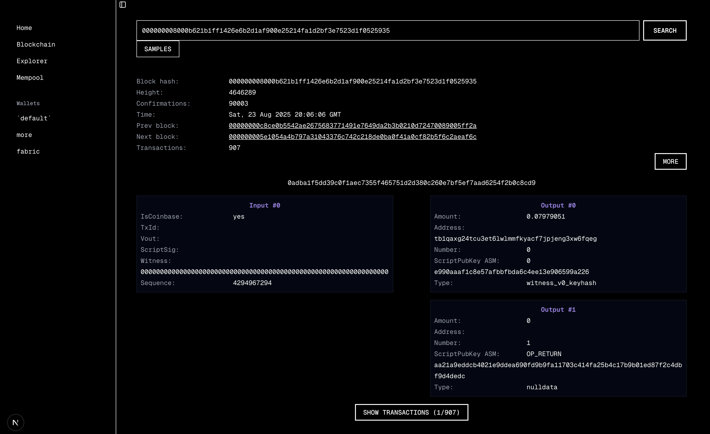
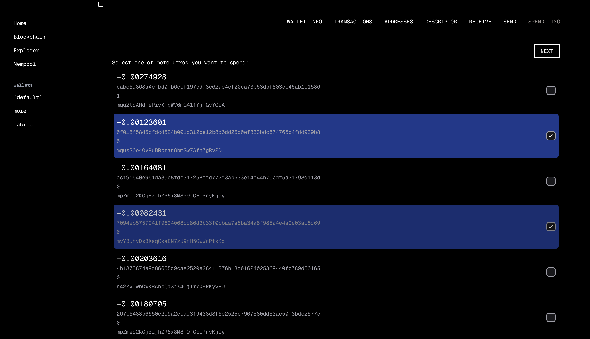

# BTC UI

BTC UI is an open-source, modern web interface for managing your Bitcoin Core full node. Built with TypeScript and React, it offers a user-friendly experience to monitor blockchain status, explore transactions and blocks, view mempool activity, and manage your wallet — all from your browser.

> **Note:** This project is a work in progress. Feedback and contributions are highly appreciated!

## Features

- **Blockchain Status:** Real-time overview of your node’s sync and network status.
- **Transactions & Blocks Explorer:** Browse recent blocks and transactions with detailed information.
- **Mempool Status:** Visualize unconfirmed transactions and mempool size.
- **Wallet Management:** View balances, manage addresses, and send/receive Bitcoin.

## Screenshots





## Getting Started

### Prerequisites

- Node.js (v16 or newer)
- npm
- A running Bitcoin Core node with RPC enabled

### Installation

Clone the repository and install dependencies:

```bash
git clone https://github.com/mauroolivo/btc-node.git
cd btc-node
npm install
```

### Running the App

Start the development server:

```bash
npm start
```

By default, the app runs at `http://localhost:3000`.

## Configuration

To connect BTC UI to your Bitcoin Core node, configure your RPC credentials and connection settings. You can do this by editing the environment variables in a `.env` file or as specified in the project documentation.

## Contributing

Contributions are welcome! If you have suggestions, bug reports, or want to submit a pull request, please open an issue or contribute directly.

## License

This project is licensed under the MIT License. See the `LICENSE` file for details.
